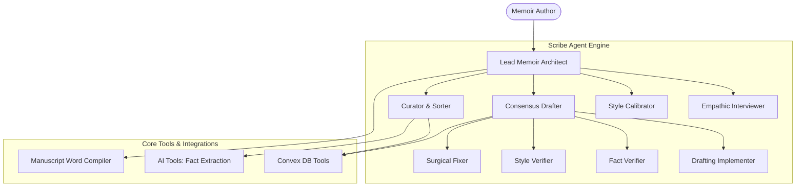

# Scribe: Unified Memoir Orchestrator & Self-Correcting Ghostwriter

Scribe is a highly sophisticated agentic memoir generation engine. Built as a standalone MCP (Model Context Protocol) server and agent runtime, it acts as an autonomous ghostwriter that guides users through interview curation, voice style calibration, facts curation, and self-correcting consensus drafting, producing a Vellum-ready `.docx` manuscript.

---

## 🚀 Key Features

*   **Unified Memoir Pipeline**: Orchestrates onboarding, structured memory harvesting, Story Bible curation, prose style calibration, and compilation.
*   **Empathetic Chapter Interviewer**: Utilizes a **Story Spine First** hierarchy (WHO, WHAT, WHEN, WHERE, WHY, SENSES) to lock down narrative facts before feelings. Operates with a **3-Tier Grounding Rule** to verify historical dates with the author contextually rather than making assumptions or hallucinating.
*   **Multi-Agent Consensus Drafting**: Implements a self-correcting consensus loop:
    1.  **Ghostwriter Implementer**: Translates raw transcripts into narrative prose using the author's calibrated voice.
    2.  **Factual Auditor (Verifier A)**: Compares drafts against the Live Story Bible to enforce absolute factual grounding.
    3.  **Style Auditor (Verifier B)**: Ensures dates, spellings, register, and rhythm match the author's voice guidelines.
    4.  **Surgical Fixer**: Resolves identified deviations while preserving unaffected prose (Minimum Change Principle).
*   **Interactive Style Calibration**: Uses a 10-question A/B quiz referencing the author's **own real memories** (extracted dynamically from interviews) instead of generic samples.
*   **Context Ingestion (Reference Uploads)**: Accepts external reference text documents (journals, family letters, historical records) to expand context in real-time.
*   **Vellum-Style Compiler**: Bundles formatted chapters, preloaded chapter images, dedication page, title page, and copyright info into a styled Microsoft Word document (.docx).

---

## 🏗️ Architecture Overview

The Scribe runtime organizes multiple specialized sub-agents coordinating through a centralized orchestrator:



---

## 🛠️ Installation & Setup

1.  Navigate to Scribe directory:
    ```bash
    cd server/scribe
    ```
2.  Install dependencies:
    ```bash
    npm install
    ```
3.  Configure `.env` files. Ensure you have the following environment variables defined:
    ```env
    # Gemini Key for Scribe's models
    GEMINI_API_KEY=your_gemini_api_key
    
    # Convex API configurations
    VITE_CONVEX_URL=http://localhost:3001
    SCRIBE_SECRET_KEY=scribe-hackathon-default-secret
    SCRIBE_TEST_USER_ID=your_test_user_id
    ```

---

## ⚙️ Running Scribe

Scribe can run in three distinct operational modes:

### 1. Web Agent Service (Frontend API Connection)
Exposes Scribe's root orchestrator as a web agent accessible by the Book of Me UI dashboard.
```bash
npm run web
```
*Starts an interactive runner on port `8000`.*

### 2. Standalone MCP Server (Stdio Transport)
Exposes database and manuscript compiling tools to local MCP hosts (like Claude Desktop, Cursor, or IDE plugins).
```bash
npm run mcp
```

### 3. Remote MCP Server (HTTP/SSE Transport)
Exposes the MCP tools over Server-Sent Events (SSE) for distributed clients or secure integrations.
```bash
npm run mcp:http
```
*Starts the SSE endpoint on port `8788`.*

---

## 🔌 Exposed MCP Tools

Any MCP-compliant client has access to:
*   `get_story_bible`: Fetches curated entities.
*   `update_story_bible`: Creates/updates entities in real-time.
*   `get_chapter_by_id`: Fetches a single chapter draft and transcript notes.
*   `get_all_chapters`: Fetches a lightweight summary list of chapters.
*   `update_chapter_content`: Saves polished chapter drafts.
*   `get_user_profile`: Fetches details like bookTitle, authorName, and language.
*   `get_prose_style`: Fetches the author's calibrated writing voice.
*   `compile_manuscript`: Triggers document compilation on the server.
